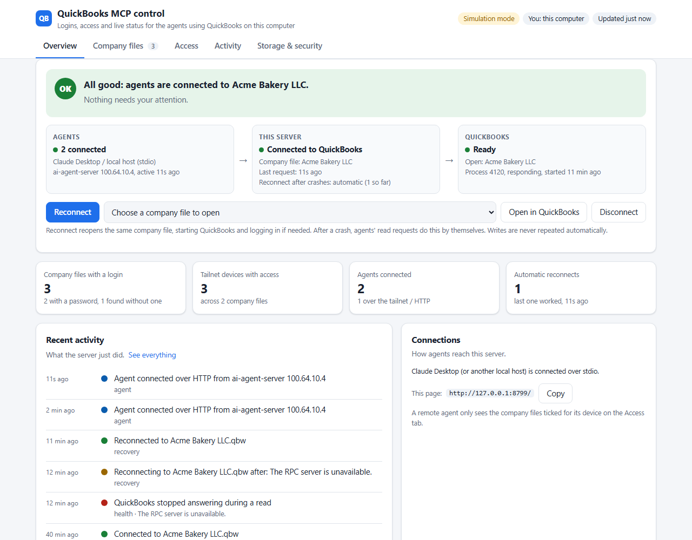
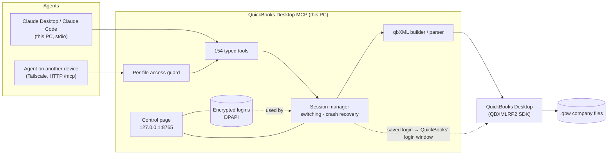
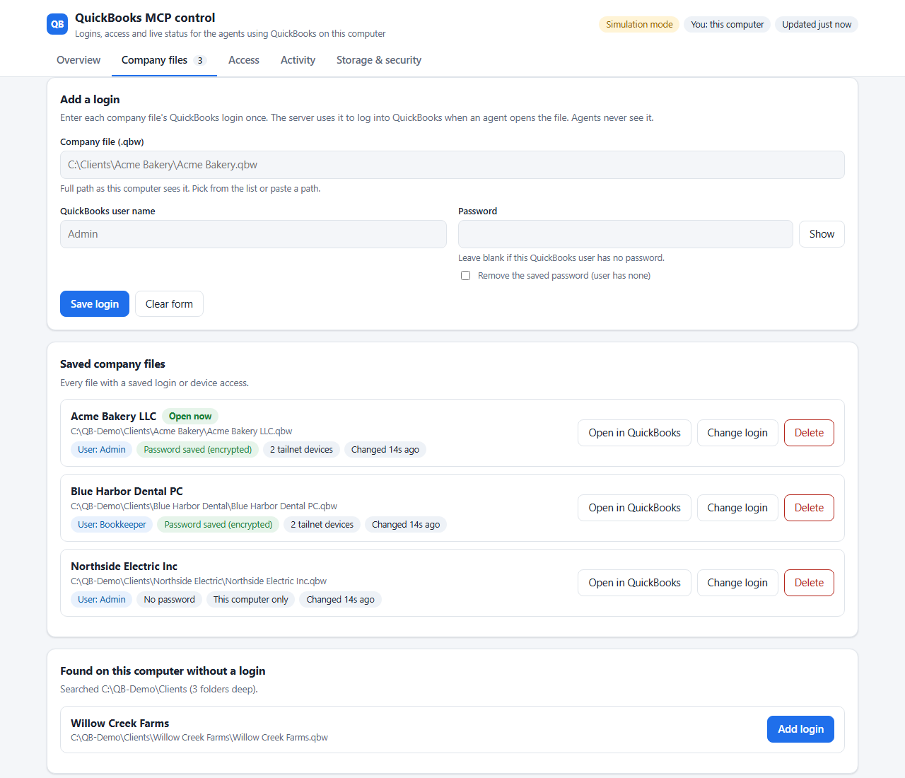
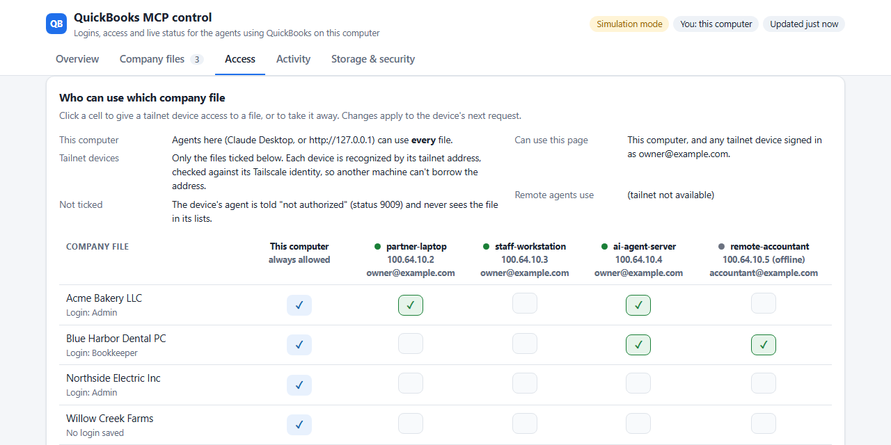
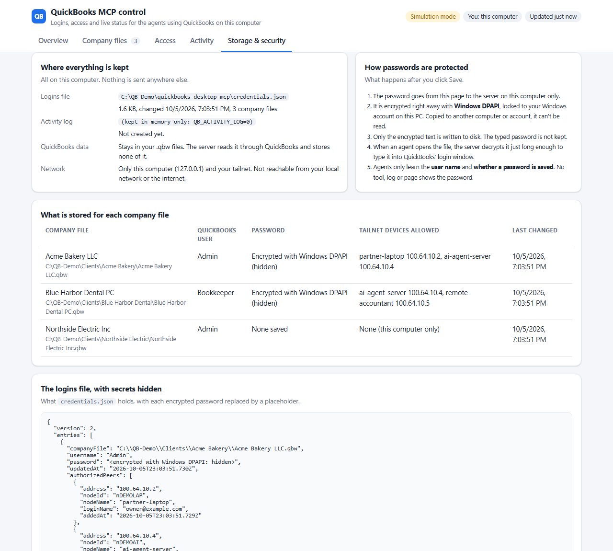
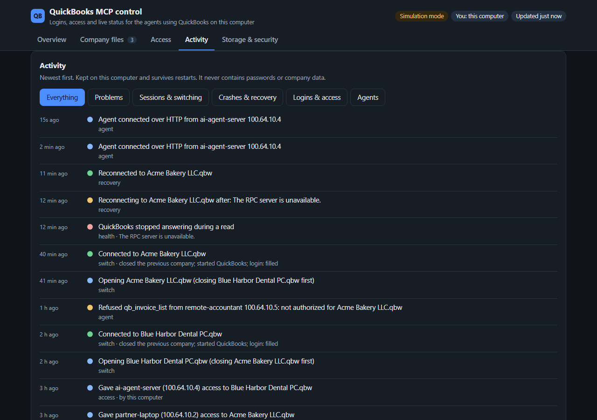

<div align="center">

# QuickBooks Desktop MCP

### Give AI agents safe, supervised hands on QuickBooks Desktop.

**154 tools** across the whole ledger · **multi-company switching with automatic login** · a **live control page** · **remote agents over Tailscale** with per-file access · **crash recovery** built for real-world desktops


[Quick start](#-quick-start) · [Control page](#-the-control-page) · [Multi-company](#-multi-company-made-easy) · [Remote agents](#-remote-agents-over-tailscale) · [Crash recovery](#-built-for-a-janky-desktop) · [Security](#-security-model) · [All tools](docs/TOOLS.md) · [Agent guide](SKILL.md)



</div>

---

## Why this exists

QuickBooks **Desktop** has no cloud API. The only way in is Intuit's qbXML SDK: a COM component on the Windows machine that runs QuickBooks, speaking an order-sensitive XML dialect. On top of that, the desktop app logs into one company file at a time and sometimes freezes or crashes.

This server deals with all of that and gives any [Model Context Protocol](https://modelcontextprotocol.io) agent (Claude Desktop, Claude Code, Cursor, opencode, Windsurf, or your own) a clean, typed tool surface. It was built for an accounting practice that moves between **dozens of client company files every day**, so it:

- switches between company files and logs into each one for you;
- shows you exactly what the agents and QuickBooks are doing;
- lets agents on your other machines work on **only the files you allow**;
- picks up by itself when QuickBooks falls over.

## ✨ Highlights

| | |
|---|---|
| 📚 **The whole ledger** | Customers, vendors, items, chart of accounts, invoices, bills, payments, estimates, sales orders, purchase orders, sales receipts, credit memos, journal entries, deposits, checks, transfers, sales tax, inventory adjustments, time and mileage, employees: **154 tools** in all. |
| 📊 **Reports that matter** | P&L, balance sheet, cash flows, trial balance (with cross-checks), general ledger, AR/AP aging, 1099 and W-2 prep, sales by customer or item, audit trail, plus a one-call **client packet** of tax-prep workpapers. |
| 🔁 **Multi-company switching** | `qb_company_open({ companyFile, closeCurrentCompany: true })` closes the open company gracefully, starts QuickBooks on the next file, **types in its saved login**, and connects. |
| 🖥️ **Live control page** | A local web page shows agents → server → QuickBooks health, logins, a file × device access grid, an activity timeline, and exactly how everything is stored. |
| 🌐 **Remote agents, per-file access** | Agents on your other [Tailscale](https://tailscale.com) devices connect over HTTP. Each device sees **only the company files you tick**, verified against its Tailscale identity. |
| 🩺 **Crash recovery** | QuickBooks crashed mid-report? Reads reconnect and retry by themselves. Writes are never repeated blindly. File Doctor and frozen windows are detected and explained. |
| 🛡️ **Safety rails** | Read-only sessions, dry-run previews, idempotency keys, edit-sequence concurrency, closing-date awareness, and a guard that rejects malformed qbXML before it reaches QuickBooks. |
| 🧪 **Simulation mode** | A faithful in-memory QuickBooks for development and demos, on any OS, with no QuickBooks needed. |

## 🧭 How it works



- **Tools never write XML.** They hand typed objects to the session manager. The builder produces qbXML in the schema order Intuit expects, and the parser normalizes responses.
- **One session, many agents.** QuickBooks has one company file open at a time. The session manager serializes switches and recoveries so agents never trip over each other.
- **Simulation and live behave the same.** Workflows developed against the in-memory store run unchanged against real QuickBooks.

---

## 🚀 Quick start

### 1. Prerequisites

- **Node.js 20.x.** The Windows COM bridge (`winax`) doesn't build on Node 22+. Use [nvm-windows](https://github.com/coreybutler/nvm-windows): `nvm install 20 && nvm use 20`.
- **Live mode:** Windows 10/11 with QuickBooks Desktop installed (Pro, Premier, Enterprise or Accountant; tested on Enterprise 24).
- **Optional:** [Tailscale](https://tailscale.com), only needed for remote agents.

### 2. Add it to your MCP host

**Claude Desktop**: `%APPDATA%\Claude\claude_desktop_config.json`

```json
{
  "mcpServers": {
    "quickbooks-desktop": {
      "command": "npx",
      "args": ["-y", "github:RealDealCPA-VR/Quickbooks-MCP-Desktop"],
      "env": {
        "QB_LIVE": "1",
        "QB_COMPANY_FILE": "C:\\Clients\\Acme Bakery\\Acme Bakery LLC.qbw",
        "QB_COMPANY_ROOT": "C:\\Clients",
        "QB_APP_NAME": "MCP QuickBooks Manager"
      }
    }
  }
}
```

> No QuickBooks on this machine? Replace the `env` block with `{ "QB_SIMULATION": "true" }` to explore with realistic sample books. JSON paths need **double backslashes**.

<details>
<summary><b>Cursor, opencode, Windsurf, any other MCP host, or a local clone</b></summary>

The same `command` / `args` / `env` block works in every host. Only the file differs:

| Host | Config file |
|---|---|
| Cursor | `.cursor/mcp.json` (project) or `~/.cursor/mcp.json` |
| opencode | `opencode.jsonc` (project) or `~/.config/opencode/opencode.jsonc` |
| Windsurf | `~/.codeium/windsurf/mcp_config.json` |
| Any stdio MCP client | `command: npx`, `args: ["-y", "github:RealDealCPA-VR/Quickbooks-MCP-Desktop"]` |

**From a local clone** (if you'll change the code):

```bash
git clone https://github.com/RealDealCPA-VR/Quickbooks-MCP-Desktop.git
cd Quickbooks-MCP-Desktop && npm install && npm run build
```

Then point the host at `node` with `args: ["C:\\path\\to\\Quickbooks-MCP-Desktop\\dist\\index.js"]`. On a machine where Node 22 is the default, give the full path to a Node 20 `node.exe`.

</details>

### 3. Save your logins once

Restart the host, then open **http://127.0.0.1:8765/**. Or just ask your agent to *"open the QuickBooks logins page"* (`qb_company_credentials_edit`). Add each company file's QuickBooks user name and password. They are encrypted for your Windows account and never shown to an agent.

### 4. Approve the app once per company file

The first time the server opens a company file, QuickBooks asks a QB **Admin** to approve "MCP QuickBooks Manager". Choose **"Yes, always allow access, even if QuickBooks is not running."** This is QuickBooks' own security step, and the server deliberately never clicks it for you.

### 5. Try it

> *"What company is open in QuickBooks?"* → `qb_company_info`
> *"Switch to Blue Harbor Dental and show me AR aging."* → `qb_company_open` → `qb_ar_aging`
> *"Is QuickBooks healthy?"* → `qb_health`

Something not working? Run the doctor: `npx -y -p github:RealDealCPA-VR/Quickbooks-MCP-Desktop quickbooks-desktop-mcp-doctor`. It checks Node, QuickBooks, the SDK, `winax` and your paths, with a fix for each ✗.

---

## 🖥️ The control page

Whenever the server runs, it serves a control page at **http://127.0.0.1:8765/**, and on your tailnet at `http://<this PC's tailnet IP>:8765/`. It refreshes every few seconds.

**Overview** (pictured at the top of this page) shows a live **Agents → this server → QuickBooks** pipeline and a plain-English health summary with the recommended next step. Its buttons are **Reconnect**, **Open in QuickBooks**, **Disconnect** and **Force close** (shown only when QuickBooks is frozen, with a typed confirmation).

| **Company files** | **Access** |
|---|---|
|  |  |
| Add or change a file's QuickBooks login. Saved logins show *"Already saved, nothing to re-enter"*, and saving overwrites the old one. Files under `QB_COMPANY_ROOT` are discovered for you, and **Browse…** picks any `.qbw` by drive and folder. | A company-file × tailnet-device grid. Click a cell to grant or revoke. "This computer" always has access. |
| **Storage & security** | **Activity** (dark mode) |
|  |  |
| Where every file lives, how passwords are protected, what is stored for each company file, and the logins file with secrets hidden. | Every session, switch, login change, access change, refused call, crash and recovery, filterable, and kept across restarts. |

> Screenshots use made-up demo data. Regenerate them with `node scripts/demo-control-page.mjs`.

---

## 🔁 Multi-company made easy

QuickBooks' SDK can't pass a user name or password. It works as whoever is logged into the file in the QuickBooks window. So the server logs in the way you would:

```text
qb_company_open({ companyFile: "C:\\Clients\\Blue Harbor Dental\\Blue Harbor Dental PC.qbw", closeCurrentCompany: true })
```

1. **Checks the file exists.** A wrong path is refused before anything is closed.
2. **Closes the open company gracefully**, like clicking its X. It never force-kills. If QuickBooks asks something (an unsaved form, a backup reminder), the switch stops and tells you which window is waiting.
3. **Starts QuickBooks on the new file** (exe found through `QB_DESKTOP_EXE`, the registry, or the standard install paths).
4. **Types the saved login into QuickBooks' login window** and presses OK, once. A wrong password is reported, never retried, and you can still type it by hand while the server waits.
5. **Connects**, and reports `closedPreviousQuickBooks` and `loginAutofill: filled | not-needed | no-credentials | …`.

`qb_company_list({ depth: 3 })` finds every `.qbw` under your client folders and flags which ones have a saved login.

## 🌐 Remote agents over Tailscale

Run agents on your other machines, such as a laptop, an AI box, or a staff workstation, against the QuickBooks on this PC:

```json
{ "mcpServers": { "quickbooks-desktop": { "type": "http", "url": "http://<this PC's tailnet IP>:8765/mcp" } } }
```

- **Per-file access.** A device can use only the company files ticked for it on the **Access** tab. Everything else returns `9009`, and its file lists only show its own files.
- **Real identity.** The caller is identified by its tailnet address *and* its Tailscale node (`tailscale whois`). A different machine at the same address is refused, and one device can't reuse another device's MCP session.
- **Who may manage the page:** this PC, devices signed into your own Tailscale account, and anyone you add with `QB_WEB_ADMINS`.
- **Agents on this PC** (stdio, or `127.0.0.1`) are unrestricted.

## 🩺 Built for a janky desktop

QuickBooks Desktop freezes on big reports, throws dialogs, crashes, and sometimes hands a file to **File Doctor**. The server is built around that:

| What happens | What the server does |
|---|---|
| QuickBooks crashes **during a report or query** | Reconnects to the same file (starting QuickBooks and logging in), retries the read once, and returns the data |
| QuickBooks crashes **during a write** | Reconnects, but **does not repeat the write**: `9011` tells the agent to check first. Idempotency keys survive the reconnect |
| A QuickBooks dialog is blocking | `9010 dialog` with the dialog's exact title, so the agent can tell you what to click |
| **File Doctor** / Tool Hub is running | Waits: it never reopens a file mid-repair (`9010 file-doctor`) |
| QuickBooks is frozen | Every QuickBooks call has a time limit, so nothing hangs forever. Rechecks after 10 s; force-closes **only** if you (or an agent with your OK) allowed it |
| QuickBooks takes the connection down with it | QuickBooks runs through a separate helper process, so a native crash kills only the helper, never the server. A fresh helper reconnects |
| You want to close QuickBooks yourself | After 10 idle minutes the server lets go of QuickBooks, so it closes normally. The next request reconnects |

**Proven against a real crash:** with QuickBooks Enterprise 24, QuickBooks was ended in Task Manager in the middle of a session. The next P&L request still came back, in 36 seconds, and the server never went down.

Agents get `qb_health` (what QuickBooks is doing right now, and what to do) and `qb_session_recover` (re-engage). You get the same picture, plus buttons, on the control page.

---

## 🛡️ Security model

- **Passwords stay on this PC.** They are encrypted with **Windows DPAPI** for your Windows account (copied elsewhere, they can't be read), decrypted only at the moment QuickBooks asks, and **never returned** by any tool, API or log.
- **Nothing is exposed beyond you.** The server listens on `127.0.0.1` and your tailnet address only, never `0.0.0.0`. The page rejects foreign `Host` headers (DNS rebinding) and cross-origin writes, never answers CORS preflights, and sends a strict CSP.
- **Least privilege for remote agents.** Access is per file and per device, checked on every call against the file open at that moment.
- **Books protection.** Read-only sessions (`9001`), dry-run previews, idempotency keys (`9002`), edit-sequence checks, and a qbXML name guard that blocks injection through free-form queries.
- **Audit trail.** The activity log records who changed which login or access, and every refused call.
- **QuickBooks' own gates stay in place.** The Application Certificate approval and QuickBooks' prompts are always left for a human.

---

## 🧰 What agents can do

| Area | Tools | Area | Tools |
|---|---:|---|---:|
| Reports & queries | 27 | Journal entries | 6 |
| Banking (deposits, checks, transfers, CC) | 12 | Sales receipts | 6 |
| Session, company, logins & health | 9 | Customers · Employees · Estimates | 5 each |
| Invoices | 7 | Accounts · Credit memos · Sales orders · Sales tax | 5 each |
| Bills (AP) | 7 | Items · Purchase orders · Statement charges · Vendors | 4 each |
| Reference lists (classes, terms, reps…) | 7 | Payments · Reconciliation · Inventory adj. · Mileage · Attachments | 3 each |
| Workpaper composites · Closing date · Time tracking | 2 each | Cache | 1 |

**→ The full reference with every argument is in [docs/TOOLS.md](docs/TOOLS.md).** Agents should read **[SKILL.md](SKILL.md)** first: it covers edit sequences, idempotency, dry-run, read-only mode, switching, remote access, crash handling, and every status code.

**Workflow prompts** (MCP `prompts/list`; shown as slash-commands in most hosts): `/month_end_close`, `/trial_balance_workup`, `/credit_card_qb_batch`, `/cc_statement_validator`, `/w2_prep`.

---

## ⚙️ Configuration

| Variable | Purpose | Default |
|---|---|---|
| `QB_LIVE` | `"1"` = talk to real QuickBooks (Windows). | simulation |
| `QB_SIMULATION` | `"true"` forces simulation; `"false"` forces live. | unset |
| `QB_COMPANY_FILE` | The company file to start with. Empty = whatever QuickBooks has open. | empty |
| `QB_COMPANY_ROOT` | Folder of client files for discovery (`qb_company_list`, the control page). | folder of `QB_COMPANY_FILE` |
| `QB_DESKTOP_EXE` | Path to `QBW.EXE` if auto-detection fails. | auto |
| `QB_APP_NAME` / `QB_APP_ID` | App identity shown in QuickBooks' approval prompt. | `MCP QuickBooks Manager` |
| `QB_QBXML_VERSION` | qbXML version. | `16.0` |
| `QB_CREDENTIALS_FILE` | Encrypted logins store. | `%APPDATA%\quickbooks-desktop-mcp\credentials.json` |
| `QB_ACTIVITY_LOG` | Activity log path (`"0"` = memory only). | `activity.log` beside the logins |
| `QB_WEB` / `QB_WEB_PORT` | `"0"` disables the page and `/mcp`; port. | on · `8765` |
| `QB_WEB_TAILNET` | `"0"` = listen on `127.0.0.1` only. | tailnet too |
| `QB_WEB_ADMINS` | Extra Tailscale logins or addresses allowed to manage the page. | — |
| `QB_HTTP_ONLY` | `"1"` = no stdio; serve only the page and `/mcp` (run as a service). | — |
| `QB_AUTO_RECOVER` | `"0"` disables automatic reconnect-and-retry after crashes. | on |
| `QB_IDLE_RELEASE_MINUTES` | Let go of QuickBooks after this many idle minutes, so you can close it normally (`0` = never). | `10` |
| `QB_COM_TIMEOUT_MS` | Give up on a single QuickBooks request after this long; QuickBooks is treated as frozen. | `600000` (10 min) |
| `QB_TAILSCALE_EXE` | Path to `tailscale.exe` if not on PATH. | auto |
| `QB_CONNECTION_MODE` | `localOnly` · `remoteOnly` · `optimistic`. | `optimistic` |
| `QB_DEBUG_QBXML` / `QB_DEBUG_LOG_PATH` | `"1"` logs every qbXML request and response (SSNs, tax IDs, account and card numbers redacted). | off · `./logs` |

<details>
<summary><b>Mode resolution</b></summary>

`QB_SIMULATION` wins when set. `QB_LIVE` only matters when it isn't.

| Platform | `QB_SIMULATION` | `QB_LIVE` | Mode |
|---|---|---|---|
| Windows | `"true"` | any | Simulation |
| Windows | `"false"` | any | Live |
| Windows | unset | `"1"` | Live |
| Windows | unset | unset | Simulation |
| macOS / Linux | `"false"` | any | Live → fails ("requires Windows") |
| macOS / Linux | otherwise | any | Simulation |

</details>

---

## 🧯 Troubleshooting

| You see | It means | Do this |
|---|---|---|
| `9007 file-conflict` | QuickBooks has a different file open | Retry with `closeCurrentCompany: true` |
| `9007 close-failed` | QuickBooks showed a prompt while closing | Answer it in QuickBooks, then retry |
| `9007 login-rejected` | The saved login was wrong | Fix it on the control page |
| `9007 launch-timeout` | QuickBooks never connected: approval prompt, upgrade prompt, or no saved login | Look at the QuickBooks window; approve once per file |
| `9007 file-not-found` | Bad path | Check the path; nothing was closed |
| `9008` | File locked by another user (multi-user) | Wait for them |
| `9009` | Remote device not authorized for that file | Tick it on the **Access** tab |
| `9010` | QuickBooks needs a person (dialog, File Doctor, frozen) | Follow `recommendedAction`; the Overview shows the same |
| `9011` | Crash during a write | Look the record up before retrying |
| `winax` won't load | Node 22+ | Use Node 20 |
| Page not loading | Server not running, or port 8765 taken | Start the server / set `QB_WEB_PORT` |
| Windows Firewall prompt for `node.exe` | First bind on the tailnet address | Allow on **private** networks only |

---

## 🛠️ Development

```bash
npm install
npm run build          # tsc → dist/
npm test               # vitest (1825 tests)
QB_UI_TESTS=1 npm test # + Windows UI tests (off-screen test windows)
npm run dev            # tsx, simulation mode
node scripts/demo-control-page.mjs   # control page with demo data
```

| Doc | For |
|---|---|
| [SKILL.md](SKILL.md) | **AI agents using the server**: patterns, workflows, status codes |
| [docs/TOOLS.md](docs/TOOLS.md) | Every tool and argument |
| [ARCHITECTURE.md](ARCHITECTURE.md) | Layers, boundaries, session lifecycle, credential store, recovery |
| [DECISIONS.md](DECISIONS.md) | Why things are the way they are |
| [REQUIREMENTS.md](REQUIREMENTS.md) | What the server must do for the operator |
| [CLAUDE.md](CLAUDE.md) · [HANDOFF.md](HANDOFF.md) · [todo.md](todo.md) | How AI coding sessions extend this project |

<div align="center">
<sub>Built for accountants who'd rather review the books than click through them.</sub>
</div>
