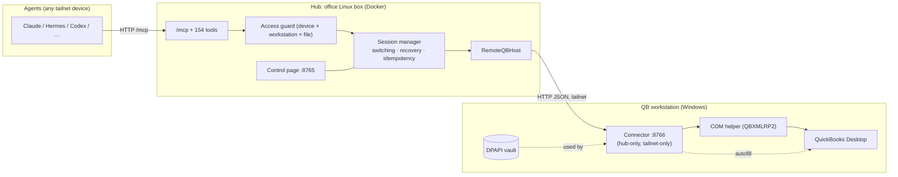

# Design: Hub + QuickBooks Connector

_Status: **approved direction, operator answers folded in** (2026-10-06). Phase 1 in progress._

## Goal

Today the whole server runs on the Windows PC that has QuickBooks. The operator wants:

- **one always-on server on the office Linux box** (the "hub"), reached over the tailnet: the MCP endpoint every agent uses and the control page;
- **each QuickBooks workstation only "connects its books"**: it runs a small connector, and nothing else needs installing or managing there.

## The constraint that shapes everything

Five things can only happen on the PC that runs QuickBooks Desktop:

| Must run on the QB workstation | Why |
|---|---|
| QBXMLRP2 COM calls | In-process COM; Intuit offers no network transport. |
| Launch / graceful close / force-close QB, exe detection | They act on that PC's processes and windows. |
| Login autofill | It types into QB's login window on that desktop. |
| Password encryption (DPAPI) | Ciphertext is bound to that PC + Windows account. |
| Health probe, `.qbw` discovery, Browse / drives | They read that PC's processes and disks. |

Everything else (tools, qbXML build/parse, idempotency, lookup cache, switching and recovery *logic*, access control, activity log, control page, tailnet identity) has no Windows dependency and can live on the hub.

This reverses the 2026-05 decision that rejected a `qb-bridge` sidecar as overkill for a single-user tool. The new requirement (central always-on server, workstations as thin attachments) is what changes the answer. To be logged in DECISIONS.md on approval.

## Architecture



### The seam already exists

`QBSessionManager` already reaches the machine only through injectable functions: `rpFactory`, `spawnImpl`, `exeResolverImpl`, `isQBRunningImpl`, `hasSavedLoginImpl`, `healthImpl`, `forceCloseImpl`, `fileExistsImpl`, `closeQBImpl`, `loginAutofillImpl`. The COM path is already out-of-process behind `QBRequestProcessor` (`com-worker-client.ts`).

**Change:** bundle them into one interface:

```ts
interface QBHost {
  createRequestProcessor(): QBRequestProcessor;        // COM, via the helper
  isQuickBooksRunning(): Promise<boolean>;
  resolveExe(): Promise<QBExeResolution | null>;
  launch(exe: string, companyFile: string): Promise<void>;
  closeGracefully(): Promise<QBCloseResult>;
  forceClose(): Promise<boolean>;
  health(opts?: { fresh?: boolean }): Promise<QBHealth>;
  fileExists(p: string): Promise<boolean>;
  findCompanyFiles(root: string, depth: number): Promise<CompanyFileEntry[]>;
  listDrives(): Promise<DriveEntry[]>;
  browse(dir: string): Promise<BrowseListing>;
  logins: { list(): Promise<CredentialSummary[]>; save(...): Promise<...>; remove(file): Promise<boolean>; hasSaved(file): Promise<boolean> };
  startLoginAutofill(companyFile: string): Promise<LoginAutofillHandle | null>;
}
```

- `LocalQBHost`: exactly today's behavior. The Windows stdio setup (Claude Desktop on the QB PC) keeps working unchanged.
- `RemoteQBHost(url, token)`: the same calls over HTTP to a connector.

Five of today's seams are synchronous (`isQBRunning`, `fileExists`, `exeResolver`, `hasSavedLogin`, `spawn`). They become async: a mechanical change at about 8 call sites in `manager.ts`.

## The connector (runs on each QB workstation)

- Same repo, new entry point: `quickbooks-desktop-mcp-connector` (bin). Node 20 + winax, as today.
- **Serves no MCP and no tools.** A small versioned HTTP JSON API (`/v1/...`) mapping 1:1 to `QBHost`. COM calls go through the existing out-of-process helper, so a QuickBooks crash never takes the connector down.
- **Binds the tailnet IP only.** It accepts requests only from the hub's Tailscale node (whois-pinned StableID) **and** with the pairing token. Anything else gets 403.
- **Runs in the logged-in user's session**, as a hidden Task Scheduler task "At log on", **not** a Windows service. Session-0 services can't see QB's login window (autofill), can't drive the QB UI, and don't see the user's mapped drives.
- **Holds no saved passwords** (see *Logins* below). The connector receives a login just-in-time for one autofill and forgets it.
- `GET /v1/info`: connector version, protocol version, hostname, QB version and running state. Used for pairing, the control page and version-skew warnings.

### Company file identity (files live on a file server)

The `.qbw` files sit on a separate file server, and every workstation opens the same files. So:

- A company file is identified by its **UNC path** (`\\fileserver\share\Client\Client.qbw`), not by workstation. Each connector translates a mapped drive letter to its UNC root (`Get-SmbMapping` / `WNetGetConnection`), because letters can differ per PC. Grants, logins and activity are keyed by that canonical path.
- Opening a file on workstation A while workstation B has it open single-user → QuickBooks' own lock → **9008**, and `recommendedAction` names the workstation that holds it, when the hub knows.

### Logins (decision: hub-held vault)

DPAPI binds a password to one PC + Windows account, so with several workstations every login would have to be typed on every PC. Instead:

- **The hub keeps the vault**, encrypted at rest (AES-256-GCM, key in the hub's data volume, mode 600, separate from the vault file). It is saved once and works on every workstation.
- At autofill time the hub sends that one login to the connector over WireGuard; the connector types it and drops it. Connectors never persist passwords.
- Agents still never receive passwords, and no tool, API or log returns one.
- **Tradeoff:** whoever controls the hub can decrypt the vault. Accepted: the hub is the office's central, tailnet-only server. Alternative kept open: per-workstation DPAPI vaults (re-enter logins on each PC).
- Migration: the `vr` connector decrypts its existing DPAPI vault locally once and hands it to the hub during pairing.

### Long calls and failures

- `BeginSession` (up to 5 min) and `ProcessRequest` (up to 10 min) are plain long HTTP requests. Tailnet RTT is about 20 ms, so a P&L's handful of round trips adds well under a second.
- If the connection drops mid-write, today's rule applies: no blind retry, **9011**. Idempotency keys stay on the hub, so they survive a connector restart.
- Connector unreachable → new status **9012 `workstation-offline`**, with `recommendedAction` ("start the connector on <workstation> / is the PC on?").
- The hub restarts while the connector holds a QB ticket: the connector's idle release (`QB_IDLE_RELEASE_MINUTES`) frees it, and the hub's first call re-opens.

## The hub (runs on the office Linux box)

- The existing server in Docker (host network, Tailscale socket mounted: the proven sandbox setup), with `QB_CONNECTORS` configured. Live endpoint: `http://100.87.42.62:8765/mcp`. The sandbox stays on :8585.
- **Access control stays on the hub**: grants are agent device × company file (UNC). No agents run on the hub, so "local" (unrestricted) callers are effectively the operator's admin actions only. Agents on workstations are ordinary tailnet devices and need grants.
- **Routing.** A request goes to the connector **on the agent's own PC** when that PC is a paired workstation, otherwise to the hub's **default workstation** (the dedicated one). `qb_company_open` gains an optional `workstation` argument to override.
- **Control page on the hub** gains a **Workstations** tab: connector status, version, QB state, Pair / Unpair. Company files, Browse and logins operate on the selected workstation through its connector.
- Activity log, health summaries and agent sessions are all hub-side.

## Pairing a workstation

1. On the control page: **Add workstation** → shows a one-line PowerShell installer (served by the hub, like the Command Center's MCP installers) with a one-time pairing code.
2. Run it on the workstation. It installs Node 20 if needed, installs the connector, creates the log-on task, opens the firewall for the tailnet only (100.64.0.0/10, private profile), and registers with the hub: it reports its tailnet identity, and the hub pins it and issues the long-lived token.
3. The workstation shows **Online** on the control page. From then on: browse its drives, save logins, open books.

## Migration from today

- The `vr` PC's existing `credentials.json` (logins + DPAPI passwords) is **reused in place** by the connector. Nothing is re-entered.
- Its per-device grants (`authorizedPeers`) are imported once into the hub (the connector lists them without secrets).
- Agents switch their URL from `100.114.92.33:8765` to the hub's `100.87.42.62:8765`. The Command Center landing page / `connect.json` change in one place.
- Running the full server on a Windows PC (stdio for Claude Desktop, `LocalQBHost`) remains supported.

## Phases

| # | Work | Verify |
|---|---|---|
| 1 | `QBHost` interface + `LocalQBHost`; async-ify the 5 sync seams. **No behavior change.** | All 1821 tests green; live smoke test on vr unchanged. |
| 2 | Connector server + `RemoteQBHost`; single workstation; credentials split; 9012; hub Docker on the tower. | Fake-connector tests in CI; live on vr: open file, P&L, switch, crash recovery through the hub. |
| 3 | Pairing + installer + log-on task + firewall; control page Workstations tab; Command Center points to the hub. | Fresh pairing of a second PC from the one-liner. |
| 4 | Several workstations **concurrently** (dedicated + operator's own): one session manager per workstation, routing by the agent's PC, `workstation` arg, 9008 lock reporting. | Two workstations' books open at once from agents on each PC. |

Phase 1 is safe to ship on its own. Phases 1-3 give one workstation (the operator's first step). Phase 4 follows soon after, for the dedicated workstation.

## Operator answers (2026-10-06)

1. **Who runs connectors:** only PCs on the tailnet; nothing outside it.
2. **Where the books live:** a separate file server → UNC identity, 9008 locking, hub-held vault.
3. **Where agents run:** on the local PCs, not the hub → workstation agents need grants; routing prefers the agent's own PC.
4. **Workstations:** one at first, soon a dedicated workstation plus the operator's own → Phase 4 is planned, not optional.
